exclude: true


```{r, include = F}
# install.packages("pacman")
library(pacman)
p_load(
  kableExtra, snakecase, janitor, huxtable, pagedown,    # formatting 
  ggplot2, ggthemes, ggeffects, ggridges,                # visualization
  igraph, network, ggpubr,
  ggformula, gridExtra, RColorBrewer,                    
  tidyverse, lubridate, stringr, dplyr, purrr,           # tidyverse & reshape  
  tibble, tidyr, lubridate, knitr,                       
  readxl, reshape2, 
  parallel, future, furrr, future.apply, doParallel,     # paralleling box
  emIRT, MCMCpack, wnominate, pscl, rgenoud, basicspace, # scaling toolbox   
  devtools, reticulate, usethis                          # R programming
)


# Define colors
red_pink   = "#e64173"
turquoise  = "#20B2AA"
orange     = "#FFA500"
red        = "#fb6107"
blue       = "#3b3b9a"
green      = "#8bb174"
grey_light = "grey70"
grey_mid   = "grey50"
grey_dark  = "grey20"
purple     = "#6A5ACD"
brown      = "#9b684d"
black      = "#000000"
# Tetradic Color
magenta_red    = "#9b4d80"
magenta_green  = "#4d9b68"
red_green      = "#9b4d59"
blue_green     = "#4d599b"
magenta_yellow = "#9b8f4d"


# Knitr options
opts_chunk$set(
  comment = "#>",
  fig.align = "center",
  fig.height = 7,
  fig.width = 10.5,
  warning = F,
  message = F
)
opts_chunk$set(dev = "svg")
options(device = function(file, width, height) {
  svg(tempfile(), width = width, height = height)
})
options(knitr.table.format = "html")

# pagedown::chrome_print("file:///Users/yenchiehliao/Dropbox/ecpr-parliarment/erfp-ecpr-parliarment.html#1", verbose = FALSE)


```


---
layout: true
# .smaller[Overview]
---
name:overview

--

- .small.hi-grey[Motivation & Puzzle:]  <br> 
  .smallest[How legislators respond to an electoral reform (from .grey-mid[__SNTV__] to .grey-mid[__SMDs__]) and adjust their positions with respect to the parties.]  <br> 

--

- .small.hi-grey[Data and Method:] <br> 
  .smallest[Taiwan's legislative .grey-mid[__roll calls__] covering the period of the reform +  .ul[__Bayesian IRT model__] for measuring .grey-mid[__ideal point estimation__]]

--

- .small.hi-grey[Theoretical Exception:] <br> 
  .smallest[.grey-mid[__SNTV-MMD__] → Divergence  .grey-mid[__MMM-SMDs__] → Converge ]  <br> 

--

- .small.hi-grey[Major Finding:] <br> 
  - .smallest[Contrary to our expectation, our empirical evidence shows that the reform has led to a high degree of polarization among legislators, both within their own party and across party lines.] <br> 
  - .smallest[The effect of the reform .grey-mid[__diminishes__] over time.]
  
---
layout: true
# .smaller[Motivation (1)]
---
name:motivation


- How electoral systems .hi-slate[_shape_] legislative preference is key to understand the theoretical development of party politics and party competition in the real world. 

--

- Previous studies have proposed a number of potential reasons that explain why legislators position themselves differently under .grey-mid[__different electoral systems__] (e.g., Catalinac 2017) or under specific electoral rules in mixed member systems (e.g., Batto 2012; Jun and Hix 2010; Rich 2014).

--

- Recent decades have seen reforms of electoral systems in East Asian democracies such as Japan, South Korea, Thailand, and Taiwan, transitioning from .grey-mid[__SNTV to SMDs__].

--

- Besides the case studies from Japan, other countries, such as .grey-mid[__Taiwan__], could be used to test these effects.

---
layout: true
# .smaller[Motivation (2)]
---
name:motivation

- .ul.small.hi-grey[Election Manifesto:] <br> 

  - .smallest[For example, Catalinac (2016) finds that Liberal Democratic Party candidates in SMDs .hi-slate[adopted new electoral strategies] by providing programmatic policy benefits such as national security among other candidates affiliated with LDP party, reducing promise of pork barrel goods and intra-party competition. ]
  
  - .smallest[In many parliaments, such as those in the UK, Germany, and Japan, .hi-slate[__roll call votes exhibit little variation__]. For example, studies in Japan often use election manifestos as a data source. ]

--

- .ul.small.hi-grey[Legislative Roll Call:] <br> 

  - .smallest[However, the situation may vary in places like Taiwan, indicating that the patterns of roll call votes could be different.]


---
layout: true
# .smaller[Theoretical Expectation (1)]
---
name:theoretical-expectation

### .hi-grey[Single Non-Transferable Vote (SNTV): ]

--

- strategic motives for coalition-building (e.g, Cox, Rosenbluth and Thies, 1999), increasing candidates to .ul.hi-slate[__seek personal votes__] (e.g, Carey and Shugart, 1995)
  
--

- .ul.hi-slate[__encourages factionalism__] and .ul.hi-slate[__nurtures money politics__] (e.g, Shugart and Wattenberg, 2001, p.38)
  
--

- legilators' positioning diverge against copatisans (Catalinac, 2016)

---

### .hi-grey[ Single Member District (SMD):]

--

- the combination of plurality rule and a single vote per voter, has the potential to .ul.hi-slate[__diminish intraparty competition__] by restricting the district magnitude to 1  (Barceló and Muraoka, 2018).

--

- where both mainstream parties .ul.hi-slate[converge] with their copartisans (Cox, 1990; Adams, 1996; Catalinac, 2016; Downs,
1990). 

--

- voters may make strategic voting on party labels (Aldrich 2011), legislators sharing similar ideological preferences often form alliances, leveraging  party labels to obtain electoral support (Riker 1982).

---

&nbsp;
&nbsp;
&nbsp;

### .hi-grey[Expectation:] 

- The transition from SNTV to SMDs reduced the degree of inter party competition between mainstream parties.

- Shifting from the SNTV system to SMDs has led to unify legislators within the same party.

---
layout: true
# .smaller[Case: Taiwan's Electoral Reform]
---
name:theoretical-expectation

&nbsp;

```{r echo = F, out.width = "100%"}
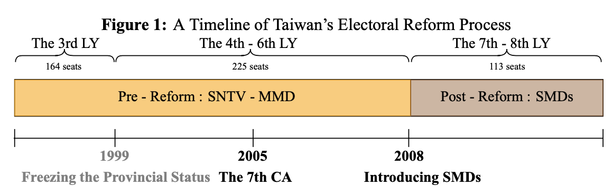
```

---
layout: true
# .smaller[Research Design & Method]
---
name:research-design

### .hi-grey[Workflow:] 

--

- First, we estimate individual legislator's ideological positions from sessional roll call votes continuously covering .hi-slate[ex-ante and ex-post periods of the reform].

--

- Estimating legislators' positions from 1992 to 2015 and .hi-slate[39-item response theory (IRT) ideal point model], with recursively updated individual priors at each session.

--

- Then, .hi-slate[inter- and intra-party distance of ideological positions] are constructed from the estimated positions.

--

- Finally, regressions are introduce to empirically examine our theoretical expectation. 

---
layout: true
# .smaller[Legislative Roll Calls]
---
name:data

- Our dataset contains 39 legislative sessions .ul.hi-slate[from 1996 to 2016] and captures the changes in legislative composition before and after institutional shifts, including a range of vote items from .hi-slate[323] to .hi-slate[1,223] and a reduction in the number of seats from __240__ to __160__. 

- Dealing with exceptionally .hi-slate[long] and .hi-slate[wide] datasets: .hi-slate[EM-based ideal point estimation].

```{r echo = F, out.width = "60%"}
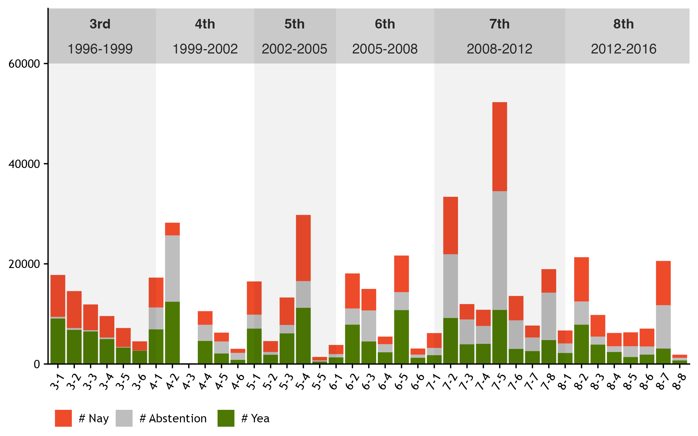
```

---
layout: true
# .smaller[Ideal Point Estimation]
---
name:data

```{r echo = F, out.width = "100%"}
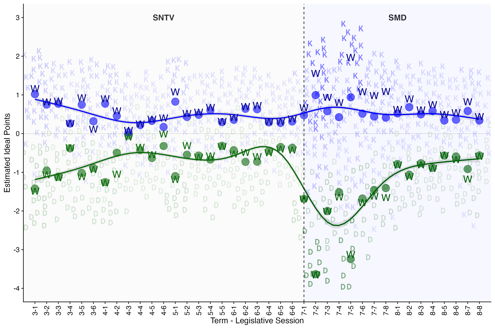
```

---
layout: true
# .smaller[Two Polarization (1)]
---
name:two-polarization-1


- .small.hi-grey[Interparty Distance]  <br> 
  .smallest[We operationalize .hi-slate[the interparty distance] as the general ideological differences between individual legislators and the whip of the opposing party, measured across each legislative session.]
$$\mathbf{interdistance_{it}=|position_{it}-\bar{whip_{it}|},}$$
&nbsp;

- .small.hi-grey[Intraparty Distance]  <br> 
  .smallest[the general ideological differences between individual legislators and the whip from her party] 

$$\mathbf{intradistance_{it}=|position_{it}-whip_{it}|,}$$
---
layout: true
# .smaller[Two Polarization (2)]
---
name:two-polarization-2


To construct a regression model that examines whether the marginal effect of time on .hi-slate[inter- and intra-party]  distance varies between pre- and post-implementation periods of electoral reform in Taiwan. 

- .small.hi-grey[Predicting the Impact on Interparty Distances:]<br>

$$\begin{aligned}
\mathbf{ interdistance_{it}=\alpha_{0}+\alpha_{1}electoralreform_{t}+\alpha_{2}year_{t}+} \\
\mathbf{\alpha_{3}(year_{t}\times electoralreform_{t})+C_{it}+\epsilon_{it}^{1}} \end{aligned}$$

- .small.hi-grey[Predicting the Impact on Intraparty Distances:]<br>

$$\begin{aligned}
\mathbf{intradistance_{it}=\beta_{0}+\beta_{1}electoralreform_{t}+\beta_{2}year_{t}+ \nonumber } \\
\mathbf{\beta_{3}(year_{t}\times electoralreform_{t})+\tilde{C}_{it}+e_{it}}\end{aligned}$$


---
layout: true
# .smaller[The Results]
---
name:results

&nbsp;
&nbsp;
&nbsp;
```{r echo = F, out.width = "95%"}
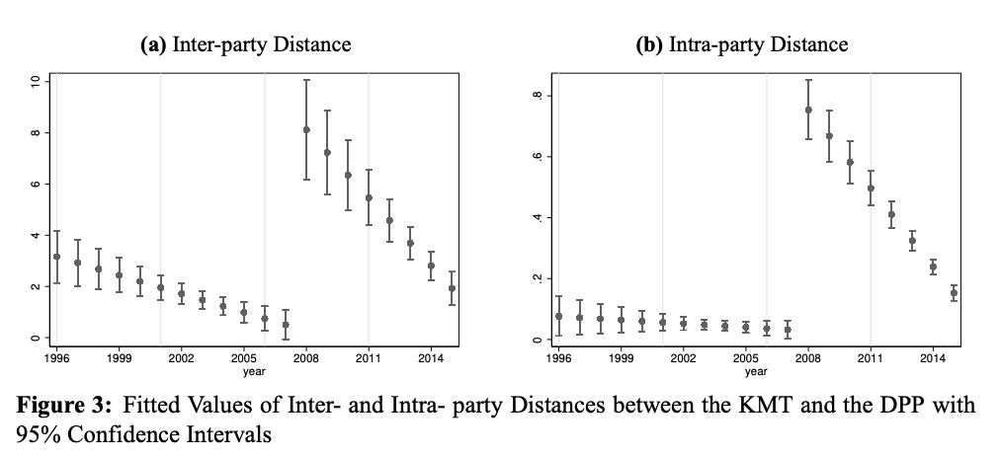
```

---

&nbsp;
&nbsp;
&nbsp;

```{r echo = F, out.width = "95%"}
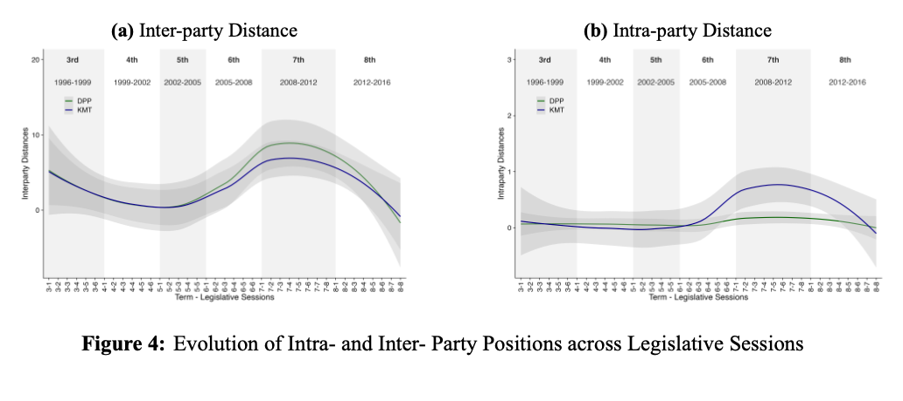
```


---
layout: true
# .smaller[Takeaway & Conclusion]
---
name:takeaway


- SMDs did not immediately improve interparty conflicts compared to the SNTV

- instead, the reform temporarily increases disagreements between mainstream parties, leading to a short-term escalation of both intra- and inter-party conflicts.

--

- The effect of the refomr exhibits significant heterogeneity between the KMT and the DPP. 

- This effect was particularly detrimental to members of the Kuomingtang (KMT), as compared to members of the Democratic Progress Party (DPP).

--

- After six years, disagreements between the mainstream parties gradually converged and returned to their pre-reform level.


---
layout: true
# .smaller[Robustness & Appendix]
---

- .smallest.hi-slate[Average Ideal Points of Legislators and Party Whips’ Positions across Legislative Sessions] .tiny[([Figure 2](#figure-2))]  <br> 

- .smallest.hi-slate[OLS Regression Predicting the Impact of Electoral Reform] .tiny[.grey[([Table 1](#table-1) | [Table 2](#table-2))]] <br> 

- .smallest.hi-slate[Estimated Legislators’ Positions] .tiny[.grey[([Table E.3](#table-e3) | [Table E.4s](#table-e4))]] <br> 

- .smallest.hi-slate[Robustness Estimation Using Separate Samples] .tiny[.grey[([Table F.5](#seperate-inter) | [Table F.6](#seperate-intra))]] <br> 

- .smallest.hi-slate[Evaluating the Heterogeneity in Voting Records]  .tiny[.grey[([Table G.7](#table-g.7) | [Table G.8](##table-g.8))]] <br> 

- .smallest.hi-slate[Robustness Assessment of the Effect of a Reform using Panel Data: Evidence from the 6th to 7th Term Observations] .tiny[.grey[([Table H.9](#table-h.9))]] <br> 

- .smallest.hi-slate[Robustness Assessment of the Reform's Effect at the Session Level using GMM] .tiny[.grey[([Table I.10](#table-i.10))]] <br> 

- .smallest.hi-slate[Validating Senior Legislators Reelected across All Legislative Sessions] .tiny[.grey[([Table A.1](#table-a1))]] <br> 

---
layout: false
class: inverse, center, middle

# Thank You

---
layout: true
# .smaller[Roll Call Ratios]
---
name:figure-2

```{r echo = F, out.width = "100%"}
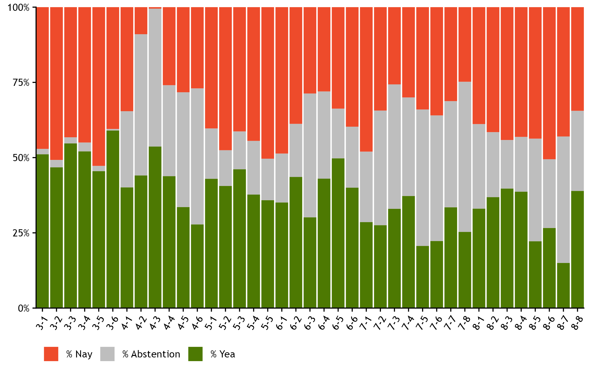
```


---
layout: true
# .smaller[OLS: The Impact of Electoral Reform]
---
name:table-1

```{r echo = F, out.width = "60%"}
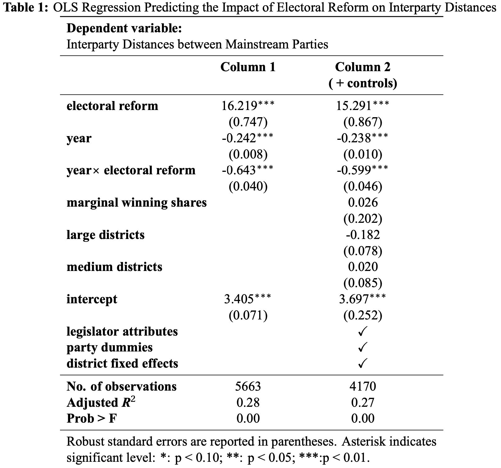
```

---

name:table-1

```{r echo = F, out.width = "60%"}
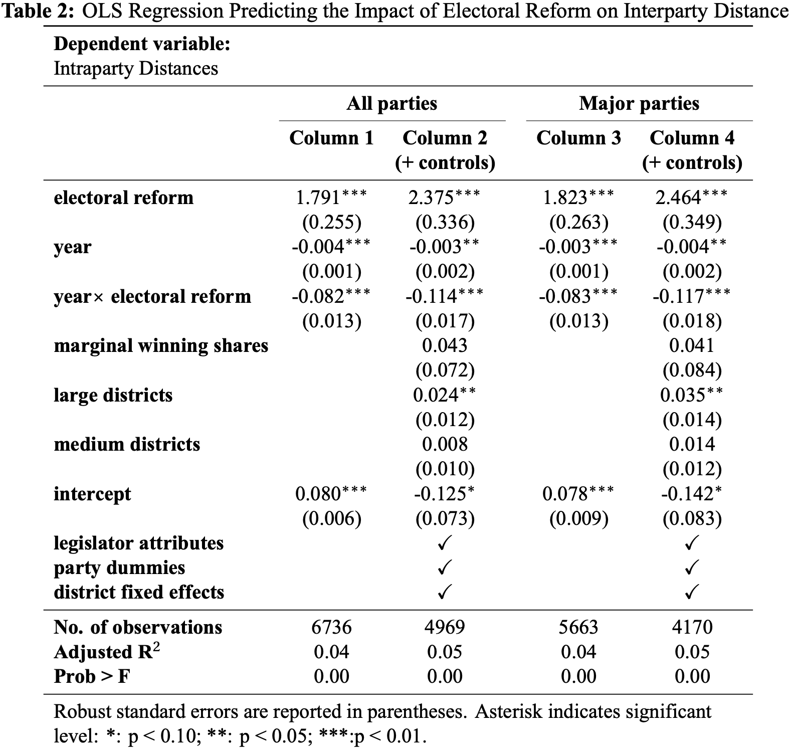
```


---
layout: true
# .smaller[Major Parties]
---
name:table-e3


```{r echo = F, out.width = "100%"}
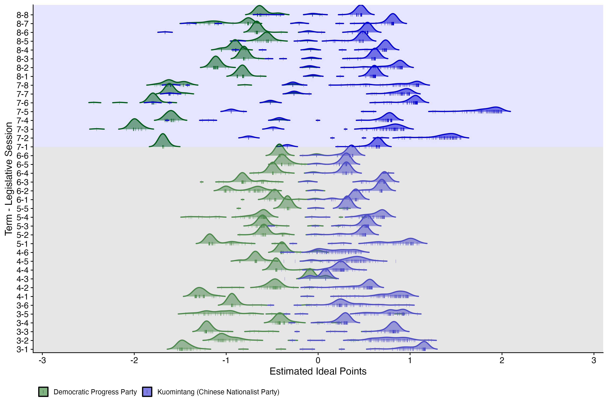
```

---
layout: true
# .smaller[Small Parties]
---
name:table-e4

```{r echo = F, out.width = "100%"}
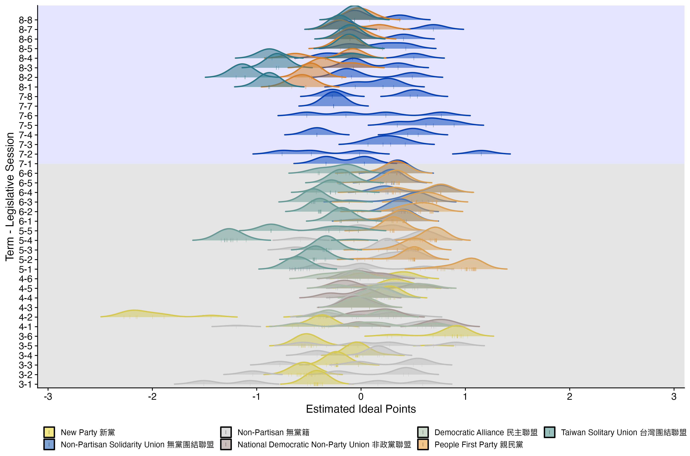
```

---
layout: true
# .smaller[Separate Samples]
---
name:seperate-inter

```{r echo = F, out.width = "80%"}
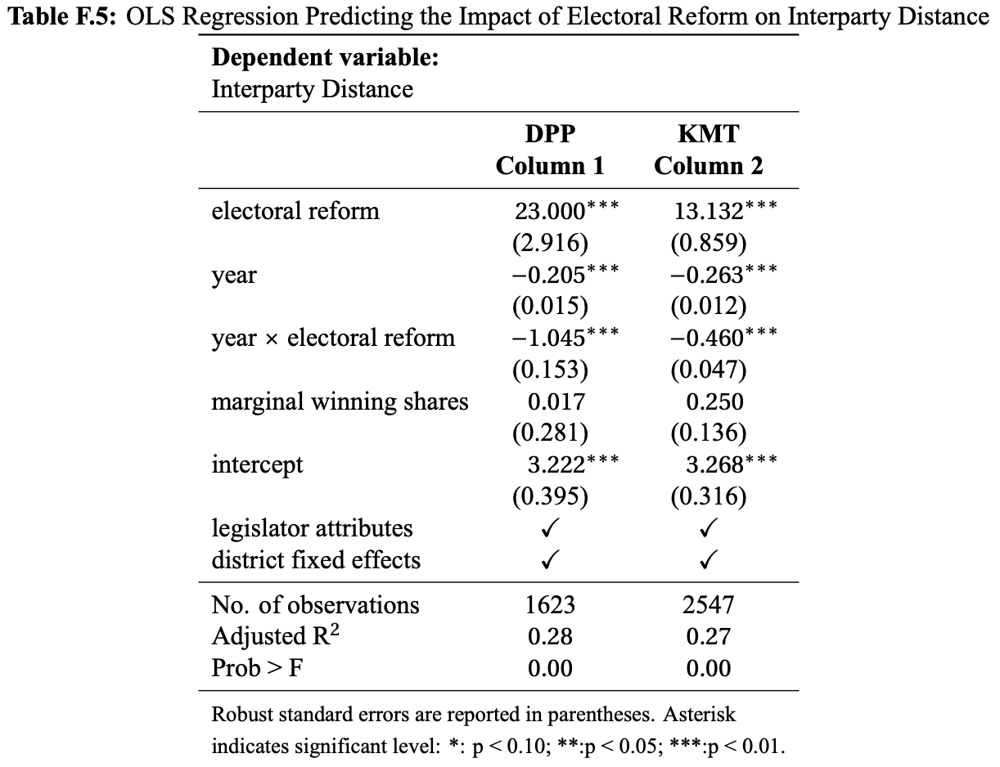
```


---
name:seperate-intra

```{r echo = F, out.width = "80%"}
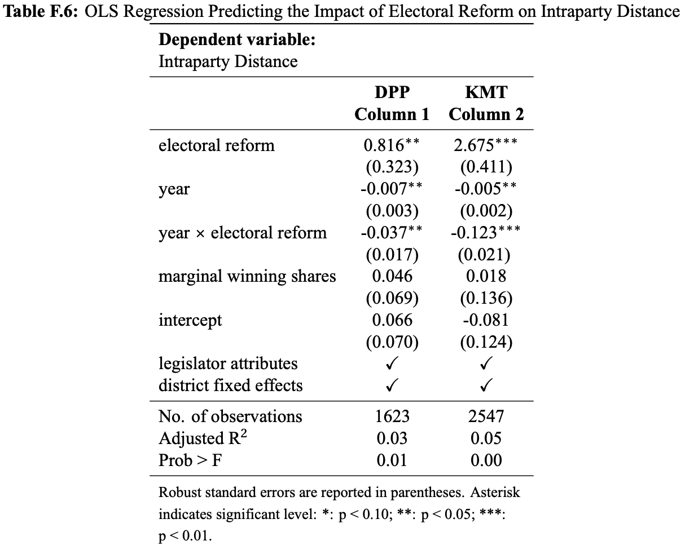
```

---
layout: true
# .smaller[Controlling for Heterogeneity Effects]
---
name:table-g.7

```{r echo = F, out.width = "55%"}
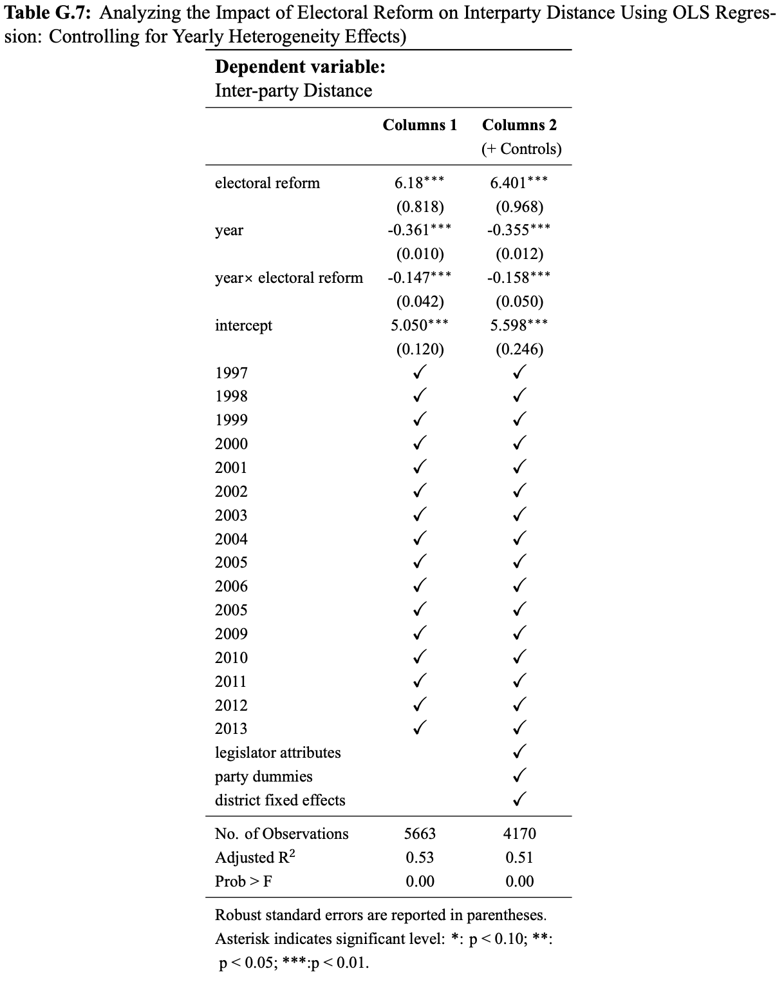
```

---
name:table-g.8

```{r echo = F, out.width = "55%"}
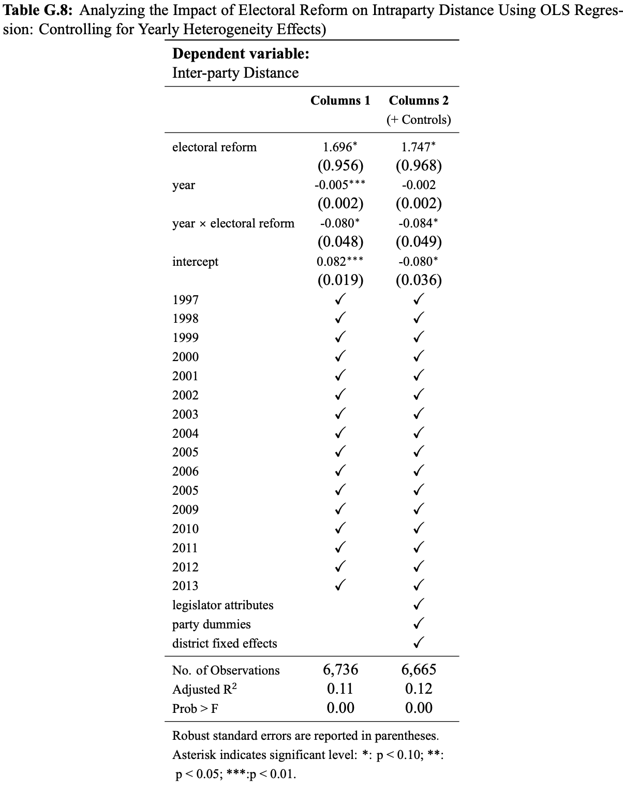
```

---
layout: true
# .smaller[Using Panel Data]
---
name:table-h.9

&nbsp;


```{r echo = F, out.width = "90%"}
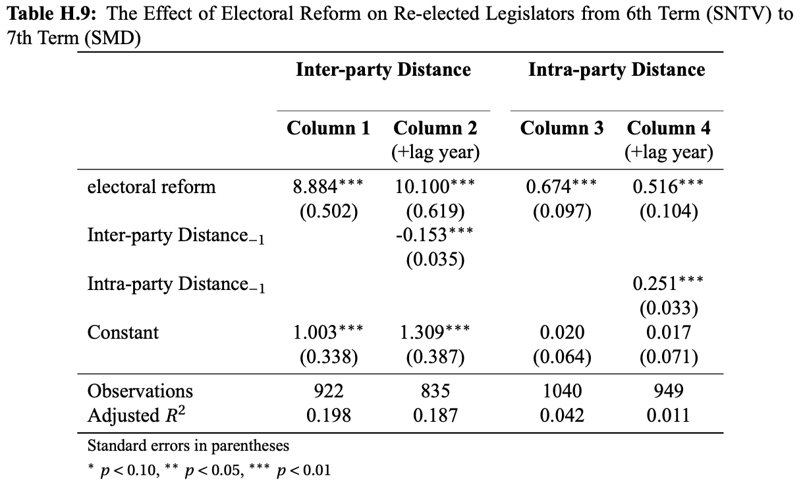
```

---
layout: true
# .smaller[Using GMM]
---
name:table-i.10

&nbsp;

```{r echo = F, out.width = "90%"}
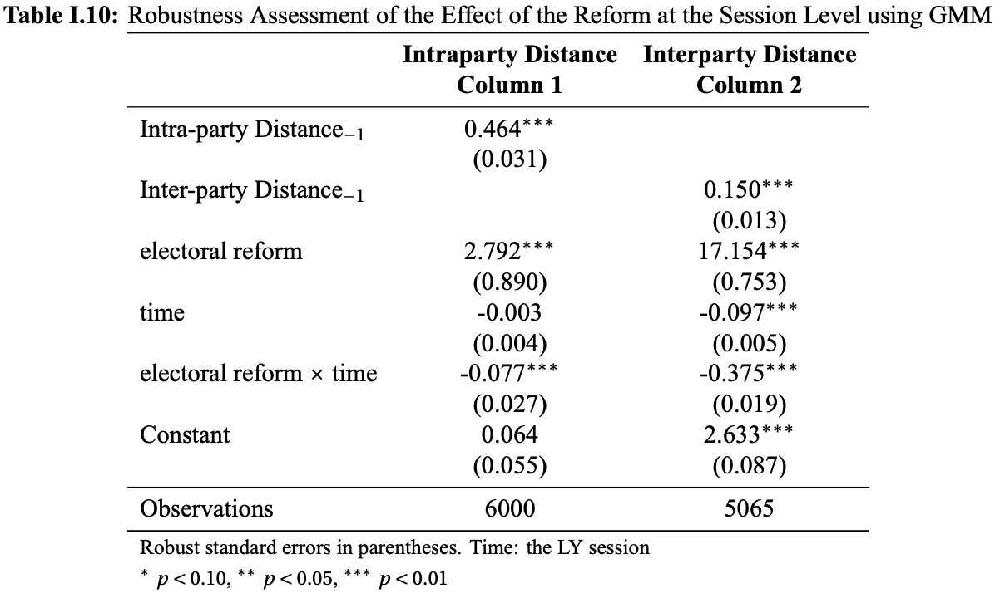
```

---
layout: true
# .smaller[Qualitative Validation]
---
name:figure-a1

```{r echo = F, out.width = "100%"}
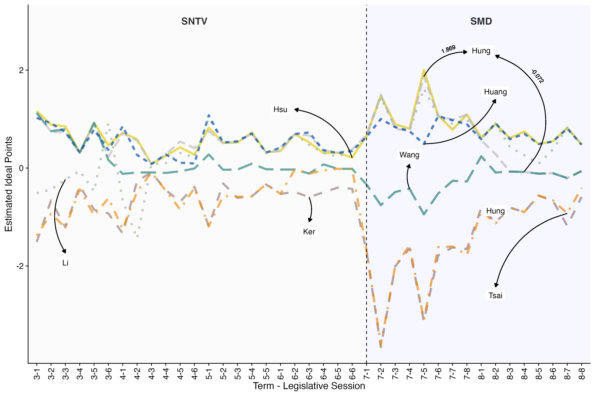
```
