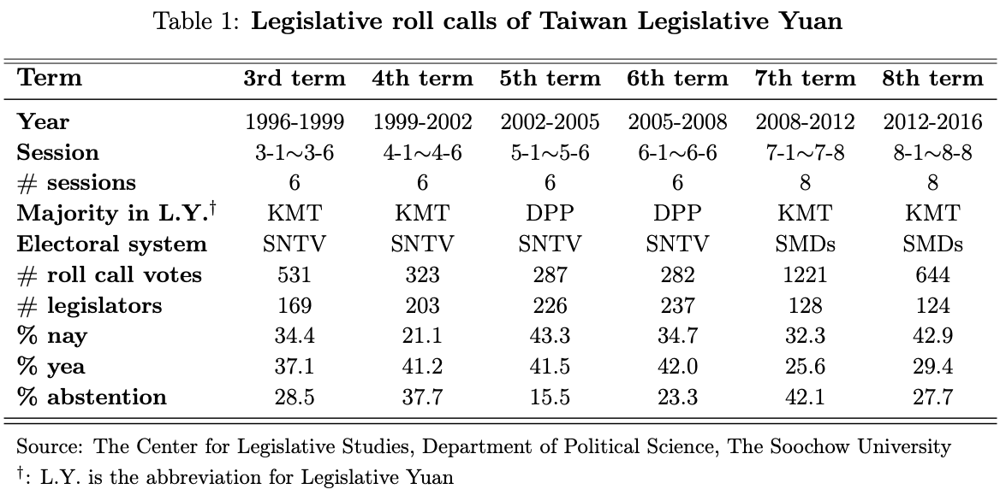
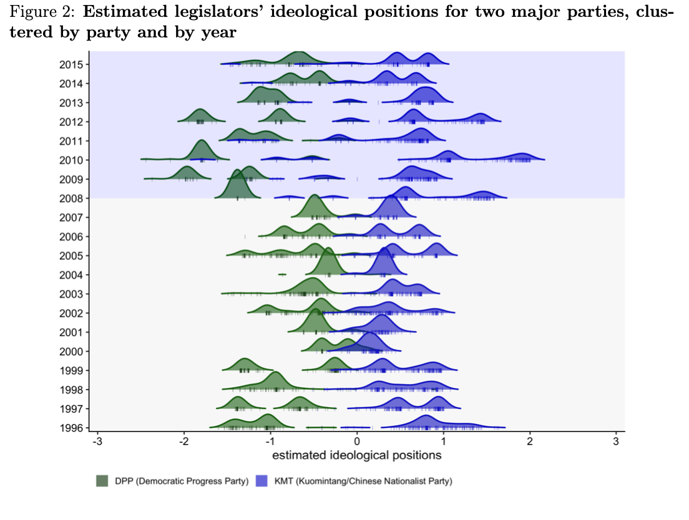
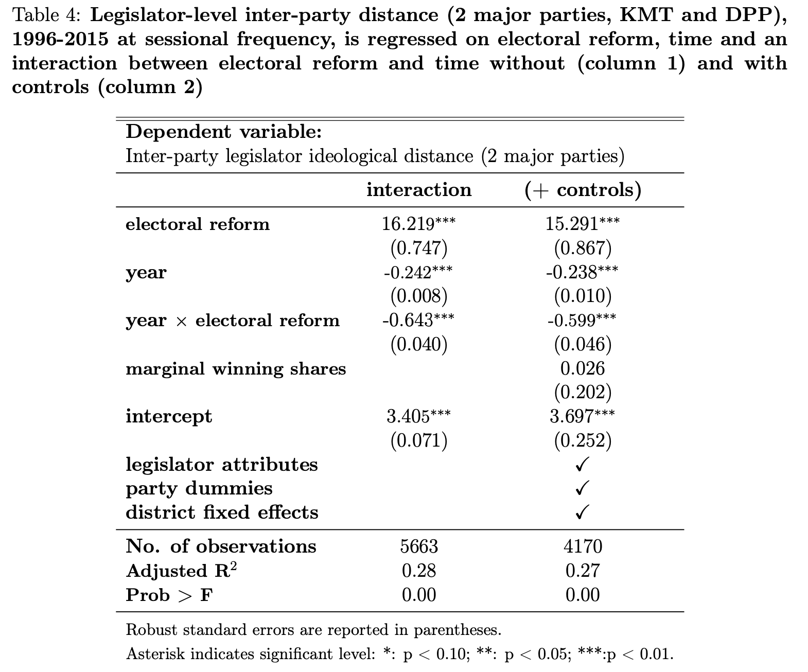
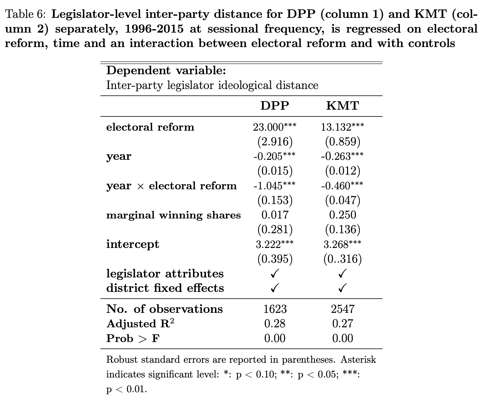
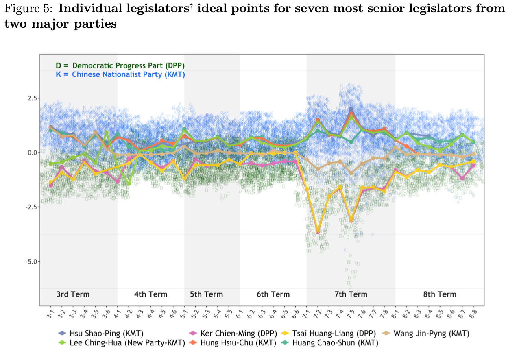
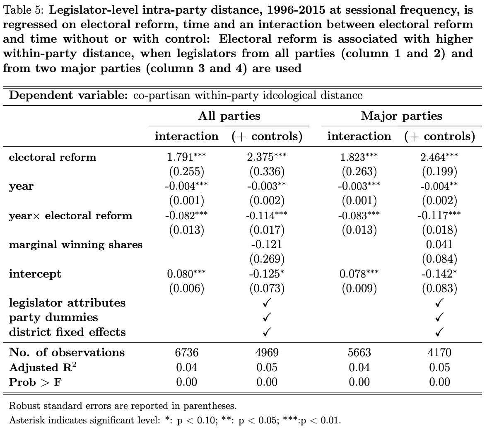
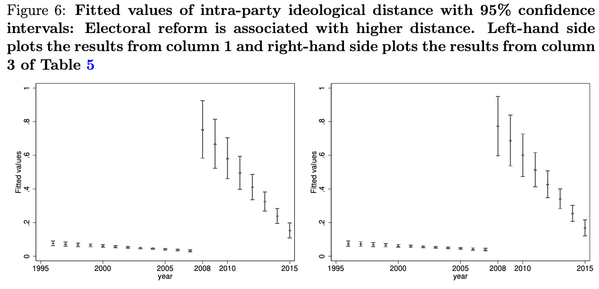
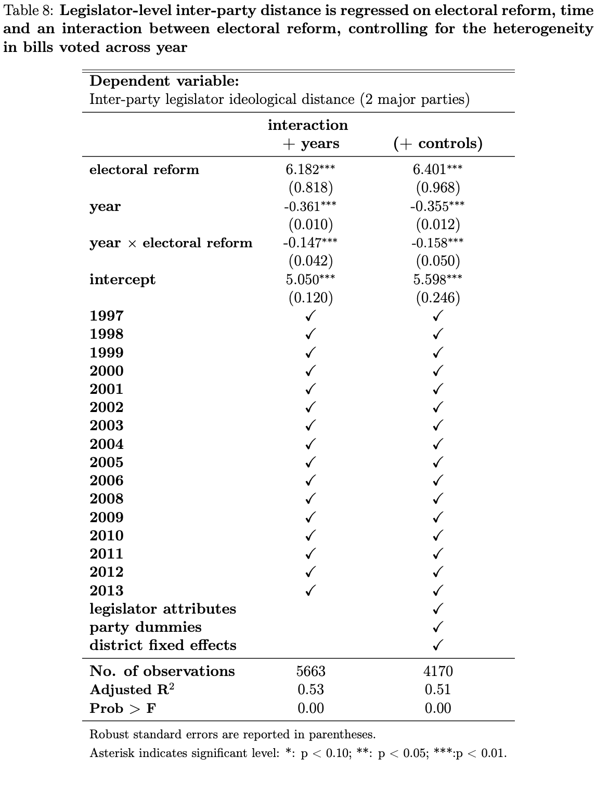
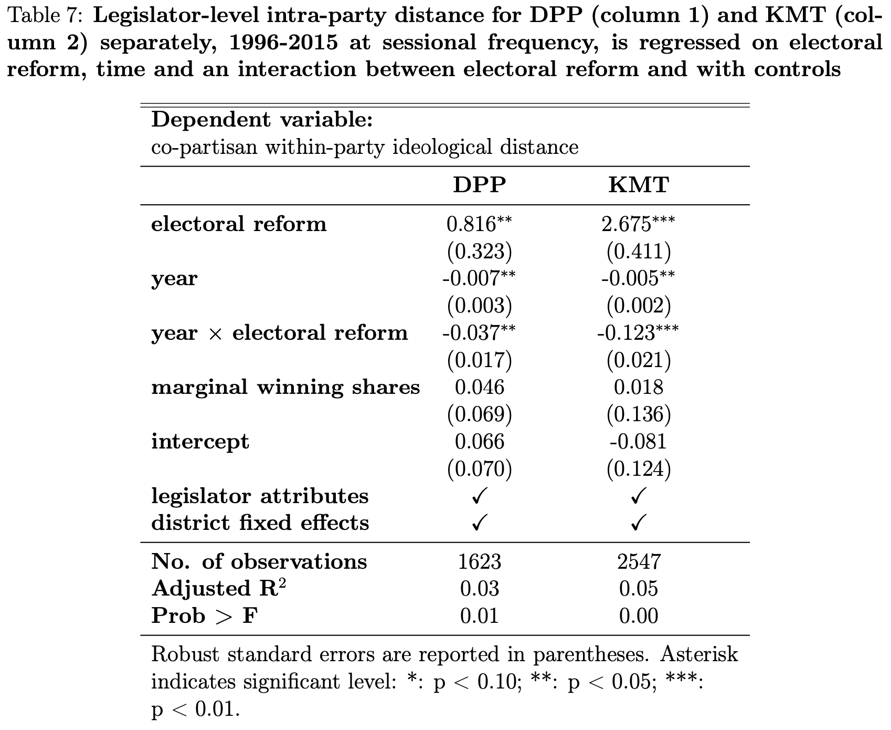
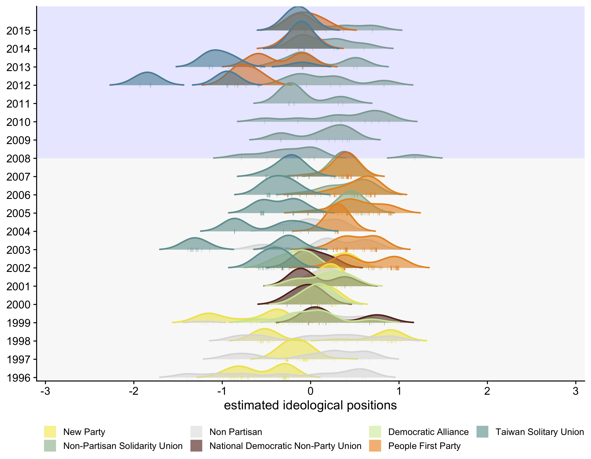

exclude: true


```{r, include = F}
# install.packages("pacman")
library(pacman)
p_load(
  kableExtra, snakecase, janitor, huxtable, pagedown,  # Formatting 
  ggplot2, ggthemes, ggeffects, ggridges, igraph,
  network, ggpubr, ggformula, gridExtra, RColorBrewer, # Visualization
  tidyverse, lubridate, stringr, dplyr, purrr, tibble,
  tidyr, lubridate, knitr,                             # tidyverse toolkit 
  readxl,reshape2, 
  parallel, future, furrr, future.apply, doParallel,   # Paralleling
  emIRT, MCMCpack, wnominate, pscl, rgenoud,
  basicspace,                                          # for scaling   
  devtools, usethis                                    # Github
)

p_load_gh("kosukeimai/emIRT", # for scaling from Github
          "cran/oc",
          "uniofessex/asmcjr",
          "wmay/dwnominate", 
          dependencies = TRUE)


# Define colors
red_pink   = "#e64173"
turquoise  = "#20B2AA"
orange     = "#FFA500"
red        = "#fb6107"
blue       = "#0300E5"
green      = "#043d08"
grey_light = "grey70"
grey_mid   = "grey50"
grey_dark  = "grey20"
purple     = "#6A5ACD"
brown      = "#9b684d"
black      = "#000000"
# Tetradic Color
magenta_red = "#9b4d80"
magenta_green = "#4d9b68"
red_green = "#9b4d59"
blue_green = "#4d599b"
magenta_yellow = "#9b8f4d"


# Knitr options
opts_chunk$set(
  comment = "#>",
  fig.align = "center",
  fig.height = 7,
  fig.width = 10.5,
  warning = F,
  message = F
)
opts_chunk$set(dev = "svg")
options(device = function(file, width, height) {
  svg(tempfile(), width = width, height = height)
})
options(knitr.table.format = "html")

# pagedown::chrome_print("file:///Users/yenchiehliao/Dropbox/erdp/slides/slides.html#1", verbose = FALSE)

```

---
layout: true
# .smaller[Overview]
---
name:overview

- .small.hi-grey[Motivation:]  <br> 
  .smallest[How does the electoral reform change legislators’ preference and their intentions to bring home the bacon? This paper quantitatively investigates this topic using the case of Taiwan Legislative Yuan and data on written parliamentary questions through an electoral reform from multi-member districts (MMD) to single-member districts (SMD).]

--

- .small.hi-grey[Theoretical Exception:] <br> 
  .smallest[This paper quantitatively investigates this topic using the case of Taiwan Legislative Yuan and data on written parliamentary questions through an electoral reform from multi-member districts (MMD) to single-member districts (SMD).] 
  .smallest[to evaluate how electoral motives shape legislators’ tendency to pork-barrel projects under different electoral systems.] 
  
--

- .small.hi-grey[Data and Method:] <br> 
  .smallest[I introduce the case of Taiwan Legislative Yuan, where the electoral system reformed through SNTV-MMD to SMD, to evaluate how electoral motives shape legislators’ tendency to pork-barrel projects under different electoral systems.]
  .smallest[webscraped the parliamentary questions from the official website of Taiwan Legislative Yuan from 1993 to 2020]

--

- .small.hi-grey[Major Finding:] <br> 
  .smallest[Evidence exists to show that legis- lators under MMD are more likely to express political intention about pork-barrel projects in written parliamentary questions.]
  .smallest[The institutional change subsequently demonstrates heterogeneous effects on large parties vis-à-vis small parties.]

---
layout: true
# .smaller[Implications]
---
name:puzzles

&nbsp;

- How electoral system shape .hi-slate[legislative preference] is key to understand the theoretical development of party politics and party competition in the real world. 

--

- Previous studies have envisioned a number of potential reasons that explain why legislators position themselves differently under .hi-slate[different electoral systems] (e.g. Catalinac 2017) or electoral rules in mixed member electoral systems (e.g. Batto 2012; Jun and Hix 2010; Rich 2014).

--

- Recent decades saw .hi-slate[reforms of electoral systems] from SNTV to SMDs in East- Asian democracies (i.e. Japan, South Korea and Taiwan). 

---
layout: true
# .smaller[Theoretical Expectation]
---

&nbsp;

- The SNTV allows .hi-slate[the district magnitude to exceed one], which creates incentives for party leaders to nominate more than one candidate to run the election.

--

- Candidates not only compete with  rivalry parties' candidates  but co-partisan candidates. This also creates .hi-slate[intra-party competition] (Cox 1990; Hirano 2006; Ames 2001) as well as encouraging factional and candidate-centered electoral politics (e.g. Batto and Huang 2016; Wu 2003).

--

- The SMDs fixes the district magnitude to one (single member) and is expected to mitigate intra-party competition (Carey and Shugart 1995; Shugart and Wattenberg 2003; André, Freire, and Papp 2014). 

---

&nbsp;

- For example, Catalinac (2017) estimates the ideological positions via scaling Japanese election manifestos and demonstrated that .hi-slate[candidates under SNTV positioned themselves against their party].

--

- Catalinac (2016) finds that Liberal Democratic Party candidates in SMDs .hi-slate[adopted new electoral strategies] by providing programmatic policy benefits such as national security among other candidates affiliated with LDP party, reducing promise of pork barrel goods and intra-party competition.

--

- Less research about testing how the electoral systems or the rules affect .hi-slate[inter-party and intra-party ideological positions] that legislators take in terms of legislative votings. 

---
layout: true
# .smaller[Hypothesis]
---
name:hypothesis

&nbsp;
&nbsp;

### .hi-grey[Hypothesis Ⅰ] 

Switching from SNTV to SMDs mitigated the level of political polarization between parties, particularly between __.blue[KMT]__ (Chinese Nationalist Party) and __.green[DPP]__ (Democratic Progress Party).

--

### .hi-grey[Hypothesis ⅠⅠ]

Switching from __SNTV__ to __SMDs__ united co-partisan legislators in terms of ideological positions.

---
layout: true
# .smaller[Taiwan Legislative Roll Calls]
---
name:data

&nbsp;


```{r echo = F, out.width = "80%"}

```

---

&nbsp;


```{r echo = F, out.width = "80%"}
knitr::include_graphics("./images/mean_rollcall.png")
```

---
layout: true
# .smaller[Estimating Ideological Preference]
---
name:data

.smallest[Imai, Kosuke, James Lo, and Jonathan Olmsted 2016. “Fast Estimation of Ideal Points with Massive Data”.  _American Political Science Review_ 110 (4) : 631–656.]

```{r echo = F, out.width = "73%"}

```

---


```{r echo = F, out.width = "85%"}
knitr::include_graphics("./images/partywhip_mean.png")
```


---
layout: true
# .smaller[Inter-party Polarization]
---
name:inter-party-polarization

&nbsp;

- To evaluate **the Hypothesis Ⅰ**, I calculate .hi-slate[the legislator-level inter-party dispersion] between two major parties, KMT and DPP (between party polarization). It is calculated as: 

$$\mathbf{interdistance_{it}=|position_{it}-\bar{whip_{it}|},}$$
--

- We specify the following regression model, allowing the passage of time (year) to have different marginal effects on inter-party ideological distance, prior to and post the electoral reform.

$$\begin{aligned}
\mathbf{ interdistance_{it}=\alpha_{0}+\alpha_{1}electoralreform_{t}+\alpha_{2}year_{t}+} \\
\mathbf{\alpha_{3}(year_{t}\times electoralreform_{t})+C_{it}+\epsilon_{it}^{1},} \end{aligned}$$

---
layout: true
# .smaller[Hypothesis Ⅰ]
---
name:first-hypothesis

```{r echo = F, out.width = "75%"}

```


---

```{r echo = F, out.width = "75%"}

```

---

```{r echo = F, out.width = "90%"}

```


---
layout: true
# .smaller[Intra-party Polarization]
---
name:intra-party-polarization

&nbsp;

- To evaluate the Hypothesis ⅠⅠ, I calculate .hi-slate[the dispersion in co-partisan legislator's estimated ideological positions (within-party disunity)]. It is calculated as: 

$$\mathbf{intradistance_{it}=|position_{it}-whip_{it}|,}.$$

--

- The regression model is constructed as follow.

$$\begin{aligned} \mathbf{intradistance_{it}=\beta_{0}+\beta_{1}electoralreform_{t}+\beta_{2}year_{t}+}	\\
\mathbf{\beta_{3}(year_{t}\times electoralreform_{t})+\tilde{C}_{it}+\epsilon_{it}^{2},}\end{aligned}$$


---
layout: true
# .smaller[Hypothesis ⅠⅠ]
---
name:second-hypothesis

```{r echo = F, out.width = "75%"}

```


---

&nbsp;

```{r echo = F, out.width = "95%"}

```

---
layout: true
# .smaller[Take-away]
---
name:take-away

&nbsp;

- Empirical results show that the reform not only .hi-slate[exacerbated] inter-party ideological polarization by distancing legislators’ positions from their opponents, but also .hi-slate[disunited co-partisan legislators] as their positions became more widely distributed along the ideological spectrum.


- This paper contributes to electoral reforms literature by adding empirical evidence .hi-slate[from Asian democracies] and highlights the ineffectiveness of using electoral reforms as means to alleviate political chaos.


---
layout: false
class: inverse, center, middle


# Thank You


---
layout: true
# .smaller[Plan]
---
&nbsp;
&nbsp;

- .small.hi-grey[Consideration]  <br> 

    + More years need to be included after the reform

    + Consider robustness check with synthetic control (Ward 2019 JEPOP)


---
layout: true
# .smaller[Appendix]
---

- .smallest[To address the issue of heterogeneity in bills voted across times] 

```{r echo = F, out.width = "48%"}

```
---

```{r echo = F, out.width = "75%"}

```

---

```{r echo = F, out.width = "80%"}
knitr::include_graphics("./images/major_postions_session.png")
```

---

```{r echo = F, out.width = "80%"}

```